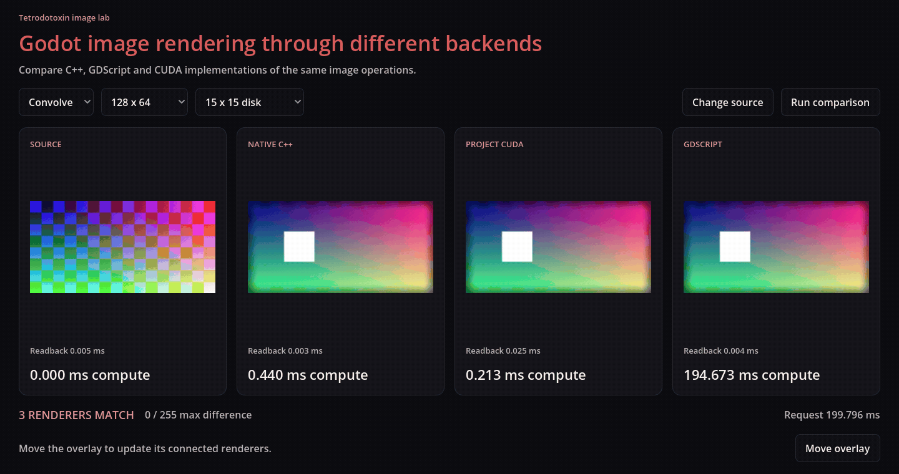

# TTX for Godot

This lab brings native C++, CUDA and GDScript implementations into the same
Godot scene through TTX contracts. Each provider owns its implementation and
storage. Godot discovers the operations it can use, connects them into an image
pipeline, and displays the result.

[Try it in your browser](https://tetrodotoxin.dev/lab/) or read
[how the pieces fit together](https://tetrodotoxin.dev/lab/#following-an-overlay-update).
The browser runs the CPU and GDScript providers. CUDA requests report that the
required provider is unavailable.

[](https://tetrodotoxin.dev/lab/)

Changing the overlay updates the downstream composition while retaining the
filtered image. Changing the source invalidates the connected pipeline. The
scene compares the results so differences between providers remain visible.
Independent C++ modules also publish classes through the same bridge,
including a counter Node and a scalar sampling interface.

## Use the extension

Download the [extension SDK bundle](https://github.com/tetrodotoxin-dev/Godot/releases/tag/v0.1.0)
for Linux or Windows. It contains the Godot bridge, its public headers and the
matching TTX and Perimortem runtimes. Providers link through the single
`godot_ttx` dependency. They compile separately from the extension and the lab.
The [counter walkthrough](https://tetrodotoxin.dev/docs/getting-started/godot-project/)
covers installation, building a provider and exporting a Godot application.

## Build the lab

To build from source on Linux, install Python 3, Bazel and Godot 4.7 or later.
Bazel downloads the pinned compiler, TTX and Perimortem SDKs, CUDA source release,
Godot C++ bindings and PocketFFT dependency.

```sh
source/demo/run.sh --cpu
```

For CUDA, install a compatible NVIDIA driver and run `source/demo/run.sh`. Bazel
acquires the CUDA headers and libraries. The addon includes the compiler and FFT
runtime libraries used by its providers. The CPU path works without CUDA.

Use `CONFIGURATION=debug` for a debug build. The bridge targets Godot 4.7's
API and is checked against the installed Godot 4.7.2 engine.

## Two parts

`source/godot_ttx/` builds the provider library and the Godot bridge. Providers link
`godot_ttx` for the shared TTX contracts and schemas. That library contains no
Godot binding code. Godot loads `ttx_bridge` through the GDExtension manifest;
it discovers providers, converts Godot values and retains constructors and
method bindings. Build `//source/godot_ttx:sdk` to package both binaries, the public
provider headers and their runtime dependencies.

`source/demo/` contains the scene and all application behavior: image operations,
CPU/CUDA providers, GDScript adapters, the counter and sampling examples, and
build/run/export scripts. Its addon bundles the generic bridge with a separate
library registering the demo's image and CUDA Resources.

## Extend the lab

The [demo scene](source/demo/lab.tscn) composes renderer cards, source Resources and
policies. [Project configuration](source/demo/project.godot) maps import names to
modules and chooses which exported declarations become Godot classes.

Native image implementations and their contracts live in `source/demo/imaging/`.
The provider entry points sit beside their CPU or CUDA implementations.
`source/demo/adapters/` supplies the Godot Resources, editor integration and GDScript
provider adapters used by this scene. `source/demo/counter/` and `source/demo/sampling/`
show independent C++ class exports through the generic extension.

Build `//source/demo:addon` and use `source/demo/install.sh /path/to/project` to install the
complete demonstration in another project. The generic archive is
`.bin/bin/source/godot_ttx/godot_ttx.tar`; the demonstration archive is
`.bin/bin/source/demo/godot_ttx.tar`.

The [website](https://tetrodotoxin.dev/) carries the wider design and ongoing
research. [Web build instructions](https://tetrodotoxin.dev/lab/source/)
describe the browser engine configuration; this checkout's export entry is
`source/demo/export.py`.
