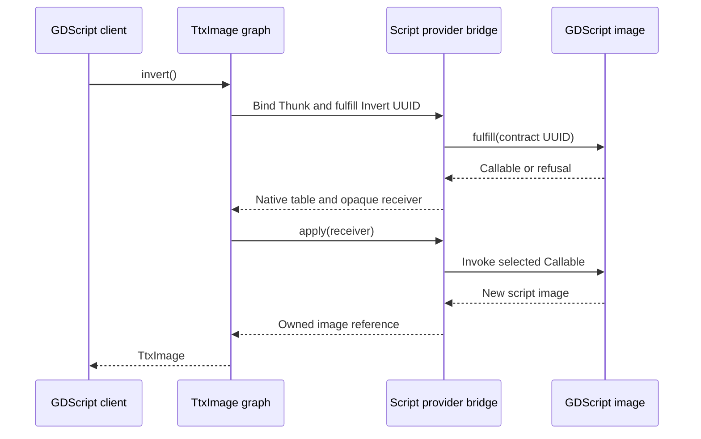

# Provider patterns exposed by the lab

The GDScript implementation makes the same image contracts available from inside
the application. Its computation is in ordinary script methods. The native bridge
only supplies the callable ABI, argument conversion and ownership that let TTX
consume those methods.



## Loading is one way to acquire a provider

The original Provider owner required `dlopen` even though the image factory
contract itself contains no such requirement. That conflated acquisition with
lifetime. [Provider::adopt](../images/provider.hpp) now consumes an existing factory
publication; native loading is a convenience that also supplies an optional
[Library](../modules/library.hpp) owner.

The Library has no dependency on image contracts, Godot, Data or Semantic. It owns
the operating system handle and lends symbols. Provider holds it until its final
reference ends, releasing the factory before the Library closes. Images and Calls
already retain Provider, so their borrowed callable tables remain executable.
The native [lifetime check](../tests/library.cpp) verifies actual module unload,
not just an internal reference count.

A GDScript factory supplies a retained Godot object instead. It has no fabricated
`.so` and no `dlclose` path. Its bridge is part of the loaded extension, while its
script objects retain their implementation through Godot's runtime.

**Potential reusable extension:** native loading could move to a platform owner
once Build or another consumer exercises the same requirements. A Semantic
publication can pair an interface with an optional lifetime owner. Data should
continue to describe/access concrete representations without learning about OS
modules or script objects.

## A borrowed binding cannot count its own users

Binding is a borrowed receiver/table pair. Copying it does not call a retain
operation, and a successful UUID negotiation cannot discover who might later copy
its fields. Tracking every bind as an implicit owning reference would change the
core contract and charge every caller for one particular lifetime policy.

The lab instead retains the supplying owner where a binding is kept: an Image or
Call. A future independently owned binding could carry an explicit lifetime token
beside its borrowed interface. Native code could use a library/publication token;
a managed provider could retain its runtime object. That would be an optional
ownership policy, with release ordering established before the first call.

No hidden bind counter, permanent module pin, global library registry or new Data
transport was needed for this implementation.

## Script authoring

Select the bundled provider with `source.provider = "gdscript"`, give that property
a custom `.gd` path, or admit an existing factory:

```gdscript
var factory = preload("res://my_image_factory.gd").new()
var source = TtxImage.new()
source.set_provider_object(factory)
source.set_rgba8(width, height, pixels)
var result = source.invert()
```

The factory's `create_image(width, height, pixels)` returns a RefCounted image.
An image provides `read_pixels()` and `fulfill(contract)`. The latter receives the
canonical UUID string and returns a Callable, or the matching Unsupported/Pending/
Rejected integer status. Strings report invocation failures. Returning success
without a Callable is rejected. A selected Callable and the supplying script
object remain retained with the native image publication.

| Existing contract | Script callable inputs | Successful result |
| --- | --- | --- |
| Invert | None | New RefCounted image |
| Convolve | PackedFloat32Array weights, integer width, integer height | New RefCounted image |
| Composite | Observed overlay PackedByteArray | New RefCounted image |
| Pixel observation | None | PackedByteArray of the promised RGBA8 extent |

The [included scripts](../providers/gdscript/) are the concrete examples. They
preserve their source arrays, implement exact RGB inversion/alpha preservation,
use spatial convolution with the same centered zero boundary, and perform integer
source-over composition. No image arithmetic is delegated to the CPU provider.

A script can supply a Callable from another object, provided it keeps that object
alive for the publication. The [delegation fixture](../tests/gdscript/fixture.gd)
uses a separate policy object retaining its implementation. The native bridge
does not require the callable receiver to be the script image itself.

The bridge knows these image contracts and their Variant conversions. A generic
bridge for arbitrary interfaces would need semantic callable descriptions or
generated adapters. Equal pointer-table representations alone cannot reveal what
arguments a script method accepts; inventing a dynamic invocation language in
Data would recreate the boundary problem this lab is meant to expose.

## Observation does not require sharing the producer's storage

GDScript can return a managed array, but it does not hand an arbitrary C pointer
to its mutable storage to another provider. The bridge offers Block and copies a
complete, extent-checked observation into the requester's storage. A script
consumer of a foreign overlay similarly receives a retained Godot array after
public Data observation, rather than a native image pointer that the script might
keep beyond its valid lifetime.

Those copies are part of this implementation's boundary. Shared or Direct access
would require a stronger representation and lifetime promise; they cannot be
inferred merely because a PackedByteArray happens to have contiguous bytes.
Pixel storage, native callable-table storage and script object state remain
separate agreements.

The visible overlay goes through a real GDScript inversion before native
composition. Moving its source refreshes that retained script result and the
composites, while preserving native blur results. Script tests verify one CUDA
overlay upload, one requested final readback and no additional FFT plan build.
The reverse direction, where GDScript composites native pixels, uses the same
public image contracts.

## Runtime and build boundaries are observable

The script provider depends on Godot's bindings because calling into GDScript
requires its runtime. CPU and CUDA remain independent of that dependency and of
the script implementation. [The dependency audit](../tools/check-boundaries.sh)
checks all three packages. The GDScript bridge is linked into the extension that
already owns Godot initialization; it does not create another godot-cpp runtime
inside a separately initialized module.

Adding ResourceLoader exposed a stale generated-header problem: the Bazel
repository rule passed a profile path to Python without recording its contents as
an input. The rule now reads/materializes the profile and generator before running
the external tool. Changes regenerate the required API without a manual cache
clear. When composing toolchains, the inputs to code generation need the same
invalidation discipline as generated semantic answers.

Godot's native Ref conversion requires RTTI in this bridge. TTX still negotiates
through UUID contracts; it does not use that RTTI as semantic proof. Native
providers and the host's TTX graph keep their existing compilation boundaries.

## Reentrant calls need a publication policy

Entering GDScript makes ordinary host callbacks possible during fulfillment,
execution, readback and destruction. A single worker alone does not stop such a
callback from replacing the source image currently being borrowed.

The image host therefore opens an [Observation](../images/observation.hpp) while
asking provider questions. It reuses the graph's existing worker depth and pull
identity. Reads can nest, but source publication and provider reconfiguration are
rejected until the observation ends. This is enforced by the host, so script and
native providers gain no dependency on graph internals or a new TTX core policy.

Source replacement first installs the complete new image and advances its revision,
then releases the previous image under the same exclusion rule. A script destruction
callback can observe the new publication but cannot recursively replace it. Tests
exercise factory, binding, invocation, pixel and destruction callbacks, including
successful publication after their scopes have ended.

Supporting publication inside an observation would require an explicit snapshot
and revision policy for the whole pull. Retaining an extra receiver pointer alone
would address only lifetime, leaving agreement between dependency revisions
unsettled. That richer policy remains separate from this synchronous lab.

## Publication lifetime is not source invalidation

The tests drop original script references and retain returned TtxImages, proving
that the bridge keeps their implementation alive. They also verify final release,
refusal, malformed results and corrected-publication recovery.

That does not implement GDScript hot reload as a TTX source policy. A published
image promises stable behavior and immutable pixels for its lifetime. Changing a
script's implementation in place would need explicit source/version invalidation
before retained graph answers could be considered current. Restart the lab after
editing provider scripts for this review; live code replacement belongs to the
later scripting/LSP integration.

The bridge is synchronous and confined to the admitting Godot worker. It adds no
scheduler or asynchronous completion contract. A future async policy must own its
request and runtime lifetime explicitly while exposing the agreed callable API.

## Measure the abstraction separately from the implementation

The [benchmark](../tests/gdscript/benchmark.gd) compares a direct call to the script
with that same script through TTX. This separates the useful algorithm from the
extra graph, publication, fulfillment and conversion work. A tiny image exposes
per-operation overhead; a larger image shows how much of it remains significant.
Native CPU and CUDA rows use the same TtxImage client path. Backend warmup does
not retain a Call across iterations. Those rows include new graph nodes, native
fulfillment and Godot Resources. The source script image does retain its published
Callable, so its own `fulfill(UUID)` runs only when that slot is first requested.

The [native mechanics benchmark](../tests/performance/main.cpp) separates these
costs from direct table dispatch and invocation through a retained binding. The
[profile and scaled measurements](performance.md) distinguish the completed
provider-owned form reuse from the remaining Resource lifecycle cost. Derived
CPU, CUDA and script images share immutable descriptor bytes without retaining
the original image. Observation and provider lifetime contracts remain intact.

For inversion the algorithms agree. For convolution the script is spatial while
native implementations use FFTW/cuFFT; their timing difference includes the
algorithmic change. Readback is outside the timed operation. Every measurement
checks the resulting bytes, and no speed ratio is an acceptance criterion.

The UI caps its script convolution workload at two million source/kernel sample
positions to keep synchronous interaction responsive. Larger native FFT cases
remain available, with the script panel explicitly marked unmeasured. This is a
presentation policy, not a claim that the script provider lacks the contract.
