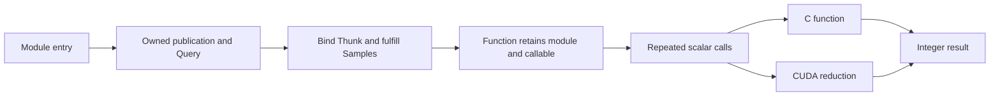

# Scalar functions without image Resources

A retained image result needs an owner for its pixels, dependency node and later
observations. A computation returning an integer does not need to construct that
owner. The sampling example fulfills a callable once, then invokes it repeatedly
with scalar arguments and a scalar result.

`TtxSampler` is one `RefCounted` created during setup. It holds a native
[Function](../sampling/function.hpp), which retains the provider and its loaded
module. Each `count` returns an ordinary Godot integer. There is no image Resource,
Call node, result allocation or UUID negotiation in the repeated invocation path.

## A computation that can be partitioned

The [Samples contract](../contracts/samples.h) counts deterministically generated
points inside a quarter disk:

```text
(seed, first sample, sample count) -> hit count
```

An index and seed determine the point completely. An unsigned integer permutation
produces two 16-bit coordinates, and the provider tests their squared distance
using 64-bit integer arithmetic. The exact rule is in the C contract. It avoids
floating-point reduction differences, so implementations and partitions must
return identical counts. The workload illustrates area estimation, with
`4.0 * hits / sample_count` approximating pi. It makes no cryptographic or
statistical error-bound promise.

The [CPU entry](../providers/cpu/samples.c) is an actual C function placed directly
in the operation table. The [CUDA implementation](../providers/cuda/samples.cpp)
generates points on the device, reduces them by block, and reads back one U64.
It allocates its counter during provider setup and reuses it. The sample array
never needs to be materialized or uploaded.

## Use it from Godot

After installing the addon, the following can run in a Godot script:

```gdscript
func sample_area() -> void:
    var cpu := TtxSampler.new()
    var cuda := TtxSampler.new()
    if not cpu.configure("cpu"):
        push_error(cpu.get_error())
        return
    if not cuda.configure("cuda"):
        push_error(cuda.get_error())
        return

    var seed := 123
    var total := 16777216
    var split := 1048576
    var left := cpu.count(seed, 0, split)
    var right := cuda.count(seed, split, total - split)
    if left < 0 or right < 0:
        push_error("Sampling failed")
        return

    var hits := left + right
    print(4.0 * hits / total)
```

CPU and CUDA use the same API and contract. The caller chooses placement by
assigning disjoint intervals, then adds their results. The
[executable script check](../tests/gdscript/sampling.gd) verifies that this mixed
answer exactly equals either provider processing the whole interval.

These calls execute synchronously and sequentially on one host worker. This
proves partitioning across provider implementations, rather than a network or
concurrent-execution scheduler. A later scheduling policy can own separate
function instances and arrange overlap without changing the mathematical rule.
Current calls are serialized per publication because CUDA reuses private scratch.

## Binding and ownership



The versioned [module entry](../sampling/provider.h) supplies the initial Query
and a release operation. [Publication](../sampling/publication.hpp) is optional
C++ support for that bootstrap. The C and CUDA providers supply different
receivers and tables. The CPU receiver is null because the function is stateless.
CUDA's receiver owns its runtime and counter. Consumers never cast either receiver
to a native implementation type.

[Function::open](../sampling/function.cpp) loads the module and fulfills Samples
through the existing TTX Semantic API. It retains the resulting handle and
releases provider state before closing the module. Moving Function transfers that
obligation. A borrowed handle cannot outlive its Function. The existing
[Modules::Library](../modules/library.hpp) serves both this owner and image
providers without a global registry or a count attached to every copied binding.

The callable UUID fixes its signature and meaning; the calling convention and
prepared Representation establish its concrete table agreement. Image and sampling
contracts have different UUIDs even though their current tables each contain one
function pointer. Matching the table's geometry does not admit another contract.

There are no changes to TTX Data, Semantic or Concept for this example. It also
leaves the existing image graph's retention and invalidation semantics intact.
Avoiding image Resource construction for a pixel-producing operation would need
an explicit caller-storage or reusable-operation contract. Reusing one mutable
Resource under existing immutable-result expectations would change those promises.

## Failures and tests

A sample interval must end at or before 2^32. An empty interval succeeds with
zero. C failure leaves its output slot unchanged; C++ returns a Result. Godot
returns `-1` and exposes a diagnostic through `get_error()`. Counts are always
nonnegative on success. A failed provider reconfiguration preserves the prior
function, and the next successful call clears the diagnostic.

The focused checks cover:

- Golden integer answers, an independent GDScript implementation, offset ranges
  and the final sample of the U32 domain.
- Same-provider and mixed CPU/CUDA partitions, plus full-interval agreement.
- Empty input, invalid signed Godot arguments, overflowing intervals and recovery.
- Unknown contracts, a wrong callable with matching table geometry, and rejected
  table Representation.
- Unchanged C output on failure, movement of the native owner, and final module
  unload after the Function ends.
- Repeated calls with zero Perimortem allocation requests, followed by increasing
  compute workloads and actual scalar device readback.

The host allocation counter runs only in the isolated native executable. It does
not count every internal driver allocation. CUDA's explicit counter allocation
is outside the invocation body. Existing image, GDScript-provider and visual
acceptance checks also remain part of `tools/check.sh`.

## Measurements and reproduction

Release measurements on the Ryzen 9 9950X3D / RTX 5070, with Godot 4.7.2 and driver
610.57.04, are medians of three batch means. Setup and first use are outside the
timer. Counts are checked, and timings are observations rather than pass criteria.

| Work per call | Native CPU | Through Godot, CPU | Native CUDA | Through Godot, CUDA |
| --- | ---: | ---: | ---: | ---: |
| Empty interval | 1.4 ns | 27.2 ns | 1.9 ns | 27.5 ns |
| One sample | 2.3 ns | 28.7 ns | 7.27 µs | 7.41 µs |
| 1,048,576 samples | 195.8 µs | 195.6 µs | 8.20 µs | 8.80 µs |
| 16,777,216 samples | 3.13 ms | 3.13 ms | 34.8 µs | 34.3 µs |

The empty CUDA interval returns without launching device work. Its time measures
only the callable path. Nonempty CUDA rows include counter reset, launch,
completion and scalar readback. The one-sample row makes that minimum device cost
visible. Native and Godot batches are independent, so small differences are
measurement variation rather than an exact overhead subtraction.

For 16,777,216 samples at seed 13 and start zero, both providers return
**13,175,861** hits. The large result gives meaningful work to accelerate while
keeping the returned value trivial. It is not an inversion speedup or a claim
that image results can always have integer-result ownership costs.

After building and installing the release addon:

```sh
bazel test //tests/sampling:check --config=release --config=cuda --test_output=all
godot --headless --path demo --script "$PWD/tests/gdscript/sampling.gd" -- --cuda
```

Omit both CUDA flags for CPU-only validation. The fixture requires CUDA when
requested. `SCALAR` output records the exact workload and sample count. Configure
the sampler once and keep it alive across repeated calls to reproduce the retained
path; creating a sampler per iteration would measure a different operation.
