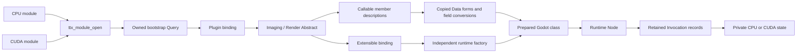

# GDClass: a terminal over TTX declarations

GDClass consumes exported TTX Abstracts and emits ordinary Godot classes. The
provider supplies behavior and its public value contracts. This terminal owns
Godot names, base classes, registrations and conversion of Godot values.



Both native modules expose the same `Imaging → Render` declaration through the
common entry. Neither includes Godot headers. The host can register that export
as `TtxCpuRender : Node` and `TtxCudaRender : Node`, or another name and suitable
native base. The same modules also retain their optional scalar sampling
capability. Inspecting Render does not initialize the CUDA sampling program.

## Discovery ends before execution

`Module` retains executable code. Its `open()` result is a separate owned
publication. Binding `Plugin` supplies the exported Abstract namespace for that
publication's lifetime. Names and members use the existing Abstract navigation
and synchronous visitor ABI.

`Extensible::emit_factory()` supplies a runtime factory that must survive the
source graph. GDClass copies the registration names, input/output representation
bytes and prepared field conversions before releasing discovery. Its emitted
`Class` retains the independent factory and module. Godot can then instantiate,
invoke and destroy objects without traversing the declaration again.

`Images::Provider` consumes the same emitted Render factory through the Render
provider UUID. It obtains independently owned backend state and retains the
module through the final image release. TtxImage's expression graph remains a
consumer of that backend. Its live source invalidation and cached image results
are different from the disposable class-discovery graph.

Destruction follows the dependency direction:

1. A runtime instance releases acquired Invocation flows before its publication.
2. Its class retains the independent factory and module through that release.
3. Class teardown unregisters Godot metadata, releases the factory, then releases
   executable code.

The class tests instrument the independent C declaration publication and fail if
runtime construction or calls query it after release. The Render tests also
release their graph before creating and invoking CPU/CUDA instances.

## Callable meaning and realization

`Concept::Callable` describes an operation UUID, its calling agreement and its
input/output Data frames. Each field supplies an encountered Abstract and a byte
placement. The field Abstract answers questions about the value's meaning.
Identical bytes alone cannot distinguish a Boolean from an integer byte, or
UTF8 text from an arbitrary buffer.

These value meanings belong to the lab's SDK-free contracts. The shared TTX
Callable contract contains no Godot type enumeration or fixed signature list.
GDClass binds field roles it understands and prepares their conversion. Unknown
roles decline class compilation. Pending and Rejected remain failures of that
encountered policy; the bridge does not resolve around it.

The bridge supports arbitrary ordered combinations of its supported Boolean,
integer, real, text and byte-buffer fields. Multiple output fields become a
Godot Array. No output becomes Godot's nil result. Frame preparation checks the
complete primitive placement once and copies the canonical representation bytes;
it does not recompile another schema or retain the declaration.

An instance supplies `Semantic::Realization::Invocation`. Preparation requests the operation
UUID, convention and complete frame representations. The provider returns a
Data writer Query for this actual C record:

```c
typedef struct ttx_invocation {
    const void *receiver;
    ttx_data_status (*invoke)(const void *receiver,
                             const void *inputs, void *outputs);
} ttx_invocation;
```

The provider supplies that compiled adapter. It can call a native implementation
or perform synchronous device/RPC adaptation behind it. Data never generates an
executable trampoline. The opaque receiver is an explicit argument of this
common call ABI; the input/output frames describe its additional payload.

Invocation negotiates a Data Flow for the record. Direct or Shared lends the
record with its agreed lifetime; Block or Fragment populates the caller's
record during setup. It retains Shared until destruction. Subsequent calls use
the acquired function and receiver directly, without further UUID negotiation,
Data transfer, signature interpretation or dispatch allocation.

The headless counter and sampler consumers use the same data-frame negotiation
as GDClass. Their runtime checks retain the acquired Invocation and verify that
repeated calls perform no further binding, graph queries or dispatch allocation.
Application signatures require no additional native-call table catalogue.

## Configuration and usage

The host chooses import locations and exported names. An export can be a single
name or an ordered array of names to visit through nested namespaces:

```ini
[ttx]
imports={"cpu":"res://addons/godot_ttx/libcpu_provider.so",
         "cuda":"res://addons/godot_ttx/libcuda_provider.so"}
classes=[{"module":"cpu", "export":["Imaging","Render"],
          "name":"TtxCpuRender", "base":"Node"},
         {"module":"cuda", "export":["Imaging","Render"],
          "name":"TtxCudaRender", "base":"Node"}]
```

```gdscript
var renderer := TtxCudaRender.new()
add_child(renderer)
assert(renderer.upload(1, 1, PackedByteArray([10, 20, 30, 255])))
assert(renderer.invert())
assert(renderer.pixels() == PackedByteArray([245, 235, 225, 255]))
renderer.free()
```

Buffer and text inputs retain their host observation through synchronous output
conversion. A provider may return a borrowed view of an input or of its own
state. Godot converts that view before another call can mutate the provider.
Numerical calls use stack frames honoring the declared aggregate alignment.

`configure("cpu")` and `configure("cuda")` on the sampling example still use the
injected import capability. Failed replacement preserves the previous callable.
Modules do not know Godot resource paths. Optional Node lifecycle policy receives
named events translated inside the bridge, rather than engine notification
numbers leaking into the arithmetic implementation.

## Verification

From the repository root:

```sh
bazel test //tests/render:cpu //tests/render:cuda --config=release --config=cuda
tests/render/check.sh
tests/classes/check.sh --config=cuda
tests/standalone/check.sh --config=cuda
tools/check.sh
```

The Render checks use the same provider artifacts in headless TTX and Godot.
They cover discovery release, generated Nodes, ordinary and typed buffer calls,
independent instance state, failed replacement, CPU/CUDA pixel equivalence and
PackedScene reconstruction. The class suite additionally covers policy refusal,
borrowed text, invalid arguments and failures during factory/instance acquisition.
The complete lab check retains the existing GDScript and rendered image oracles.

The current bridge supports synchronous methods and the listed value roles.
Additional value policies need host conversion support, while additional
signatures composed from existing roles do not. Properties, signals, virtual
methods, hot replacement and asynchronous operation policy remain separate work.
